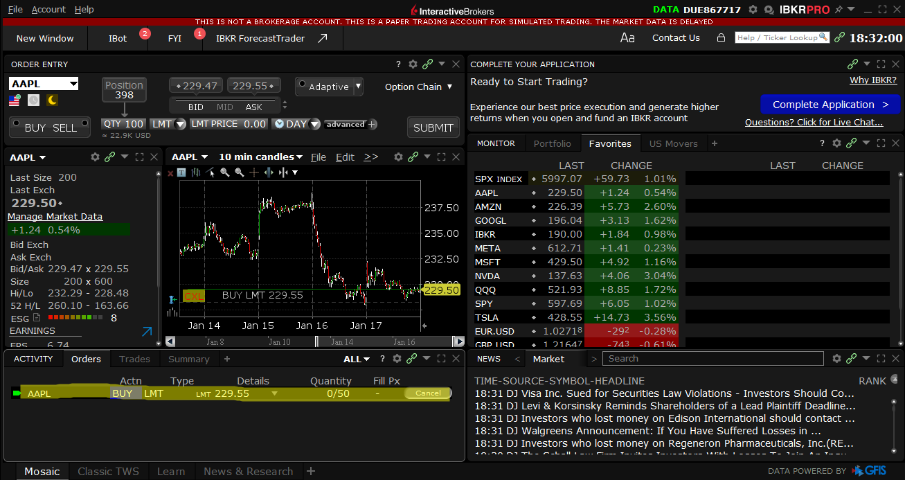
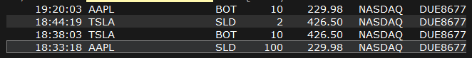
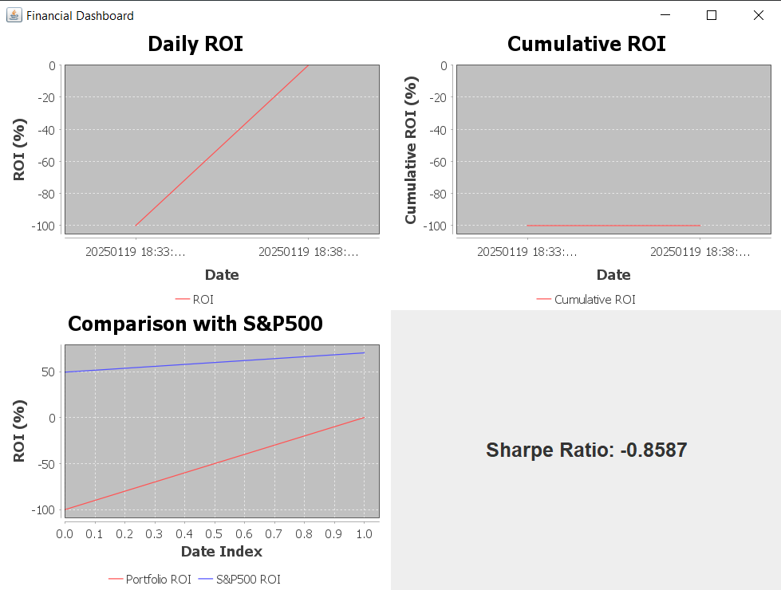

# financePortofolio
# Financial Dashboard and Analytics Application

## Overview
This project is a comprehensive financial analytics application designed to process, analyze, and visualize financial data. The application integrates data from multiple sources, including **Interactive Brokers (IB) API** and **Yahoo Finance API**, to calculate metrics such as ROI, volatility, and Sharpe Ratio. It provides a graphical user interface (GUI) to display financial insights, including ROI trends, cumulative performance, and comparisons with the S&P 500 index.

## Features
- Fetches and processes financial data using:
  - **Interactive Brokers API** via a custom implementation of the `EWrapperDefault` framework.
  - **Yahoo Finance API** for real-time stock prices, historical charts, and market data.
- Calculates financial metrics including:
  - **ROI (Return on Investment)**
  - **Volatility** (standard deviation of returns)
  - **Sharpe Ratio** (risk-adjusted return)
- Provides a GUI dashboard using **JFreeChart** to visualize:
  - Daily ROI
  - Cumulative ROI
  - Portfolio performance comparison with S&P 500
  - Sharpe Ratio
- Exports processed data to CSV files for further analysis.

---

## Technologies Used
- **Java**: Core programming language.
- **Swing**: Used for creating the graphical user interface.
- **JFreeChart**: For data visualization (charts and graphs).
- **OkHttp**: For making HTTP requests to Yahoo Finance API.
- **Interactive Brokers TWS API**: To fetch real-time and historical transaction data via `EWrapperDefault`.

---

## Data Sources
### 1. **Interactive Brokers API**
- Used to retrieve transaction execution details via the `EWrapperDefault` implementation.
- Real-time and historical data collected through methods such as:
  - `execDetails`: To process individual transaction details.
  - `execDetailsEnd`: To signal the end of transaction processing.

### 2. **Yahoo Finance API**
- Used for fetching stock prices, historical charts, and S&P 500 market data.
- Endpoints used:
  - `/api/stock/get-chart`: For historical chart data.
  - `/api/market/get-sp-500`: For S&P 500 data.
  - `/api/stock/get-price`: For real-time stock prices.

---

## Application Flow

### 1. **Data Collection**
- **Interactive Brokers**: Transaction details are fetched using `TWSConnector`, which connects to the IB Gateway or TWS via `EClientSocket`. The data is processed in `MyEWrapper` and stored in a list of `TransactionDetail` objects.
- **Yahoo Finance**: Stock prices, historical charts, and S&P 500 data are fetched using the `YahooFinanceAPI` class and saved to CSV files.

### 2. **Data Processing**
- The `ObtaintAllData` class reads data from CSV files into structured objects:
  - `TransactionDetail`: Represents individual transactions.
  - `StockChart`: Represents stock price charts.
  - `SP500Entry`: Represents S&P 500 index data.
  - `StockPrice`: Represents real-time stock prices.
- The `FinancialManager` class calculates key financial metrics:
  - ROI for individual transactions.
  - Volatility using historical stock prices.
  - Sharpe Ratio as a measure of risk-adjusted return.

### 3. **Visualization**
- The `FinancialDashboard` class creates a GUI using `Swing` and `JFreeChart` to visualize:
  - Daily ROI trends.
  - Cumulative ROI performance.
  - Comparison of portfolio performance with S&P 500.
  - Sharpe Ratio.

### 4. **Export**
- Processed data is exported to CSV files using the `CSVExporter` class for external analysis.

---

## Use Case
### Portfolio Performance Analysis
The application is designed for financial analysts and investors who want to:
- Evaluate the performance of their investment portfolio.
- Compare portfolio returns with market benchmarks like the S&P 500.
- Analyze risk-adjusted returns using metrics like the Sharpe Ratio.
- Visualize trends in ROI and cumulative performance over time.

### Workflow
1. Connect to the **Interactive Brokers TWS/IB Gateway**.

3. Fetch transaction data and process it into a structured format.
4. Fetch additional market data from the **Yahoo Finance API**.
5. Calculate financial metrics such as ROI, volatility, and Sharpe Ratio.
6. Display the metrics and trends in a user-friendly GUI.

The portfolio underperforms compared to the S&P500 benchmark because the sell (SLD) transactions either match or fall below the buy (BOT) prices, resulting in minimal or negative returns.

8. Export the processed data to CSV for further analysis.

---

## How to Run
1. **Set up Interactive Brokers TWS/IB Gateway**:
   - Ensure TWS or IB Gateway is running.
   - Configure the API settings to allow connections.
   - Update the connection parameters in `TWSConnector` (host, port, and client ID).

2. **Set up Yahoo Finance API**:
   - Obtain an API key from [RapidAPI](https://rapidapi.com/).
   - Configure the API key and host in the `Config` class.

3. **Prepare CSV Files**:
   - Place the required CSV files (e.g., `executions.csv`, `stock_chart_AAPL.csv`, `sp500.csv`, `stock_price_AAPL.csv`) in the project directory.

4. **Run the Application**:
   - Execute the `FinancialDashboard` main method.
   - The GUI will display the calculated metrics and visualizations.

---

## Project Structure
